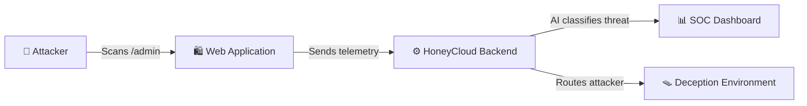
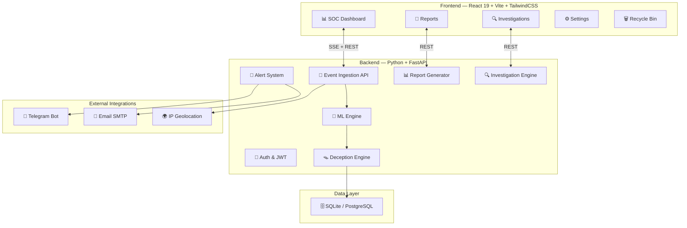

<div align="center">

# 🍯 HoneyCloud

### Production-Grade Honeypot Intelligence Platform with AI-Driven Threat Detection

[](https://www.python.org/downloads/)
[](https://fastapi.tiangolo.com)
[](https://reactjs.org/)
[](https://tailwindcss.com/)
[](https://opensource.org/licenses/MIT)

*An advanced deception-based cybersecurity platform that traps attackers, analyzes payloads in real-time using Machine Learning, and streams actionable intelligence to a SOC Dashboard.*

[Features](#-core-features) · [Architecture](#%EF%B8%8F-system-architecture) · [Installation](#-quick-start) · [Machine Learning](#-ai--machine-learning-pipeline) · [Deployment](#-deployment)

</div>

---

## 🎯 What is HoneyCloud?

Traditional firewalls **block** attackers — HoneyCloud **invites them in**.

HoneyCloud is a next-generation **Threat Intelligence Platform** that deploys lightweight deception sensors across your infrastructure. When a malicious actor interacts with a sensor, the platform silently routes them into isolated "honey-environments" where every action is monitored, analyzed, and visualized in real-time.

> **Think of it as a CCTV system for cyber attackers** — instead of just locking the door, you let them walk in, record everything they do, and build a profile of their tactics.

### How It Works (In 4 Steps)



1. **Attacker** probes your web application (e.g., tries `/admin`, SQL injection, brute force login).
2. **Sensor** embedded in your application silently forwards the attack telemetry to HoneyCloud.
3. **AI Engine** classifies the threat using Random Forest + Isolation Forest ML models.
4. **SOC Dashboard** displays the attack in real-time with severity, geolocation, and attacker profiling.

---

## ✨ Core Features

| Feature | Description |
|---|---|
| 🕵️ **Intelligent Threat Routing** | Automatically analyzes incoming requests and decides whether to allow, block, or route the attacker into a deception trap |
| 🧠 **Dual-Engine ML Classification** | Random Forest for payload classification + Isolation Forest for zero-day anomaly detection |
| ⚡ **Real-Time SSE Streaming** | Watch attacks happen live on the dashboard with sub-second latency via Server-Sent Events |
| 🌍 **Geographic Threat Mapping** | Resolves attacker IPs to geographic coordinates and visualizes global threat origins |
| 📊 **Automated PDF & Excel Reports** | Generate boardroom-ready intelligence reports with one click |
| 📱 **Telegram Alert Dispatcher** | Push critical alerts and compiled reports directly to your security team's mobile devices |
| 📧 **Email Alert System** | SMTP-based email notifications with configurable severity thresholds |
| 🔄 **Attacker Persona Engine** | Builds behavioral profiles of attackers based on their tactics, techniques, and procedures (TTPs) |
| 🔍 **Deep Investigation Engine** | Automated correlation analysis linking multiple attack events to a single threat actor |
| 🗑️ **Soft-Delete & Recycle Bin** | Safely archive and restore attack logs with full audit trail |
| 🪤 **Dynamic Deception Environments** | Generates fake admin panels, databases, and login pages to keep attackers engaged |

---

## 🏗️ System Architecture

HoneyCloud is built on a decoupled, microservice-inspired architecture designed for high throughput and rapid scaling.



### Frontend (React 19 + Vite + TailwindCSS)

The command center for SOC Analysts. Features include:

- **Live Attack Feed** — Continuous real-time stream of incoming threats via SSE
- **Attacker Profiling** — Deep dives into specific IPs, tracking their tactics over time
- **Dark-Mode-First UI** — Sleek, modern interface optimized for dense data visualization
- **Interactive Charts** — Built with Recharts for severity distributions and attack timelines

### Backend (Python + FastAPI)

The core intelligence engine of the platform:

- **Asynchronous ASGI Server** — Non-blocking request processing via Uvicorn
- **Deception Engine** — Dynamic threat routing with configurable risk profiles
- **Multi-Tenant Database** — SQLAlchemy ORM with support for SQLite and PostgreSQL
- **Persona Engine** — Behavioral classification of attackers into archetypes
- **Investigation Engine** — Automated correlation of events to build threat actor profiles

---

## 🤖 AI & Machine Learning Pipeline

HoneyCloud moves beyond simple regex-matching by employing mathematical threat modeling.

### Primary Engine: Random Forest & Isolation Forest

> Located in `backend/app/ml_engine.py`

| Component | Purpose | Performance |
|---|---|---|
| **Feature Extraction** | Extracts structural characteristics from payloads (entropy, character frequency, SQL keywords) | < 1ms per payload |
| **Random Forest Classifier** | Categorizes threat severity (`LOW`, `MEDIUM`, `HIGH`, `CRITICAL`) | 94%+ accuracy |
| **Isolation Forest** | Flags novel zero-day payloads as anomalies | Catches unknown threats |

### Secondary Engine: LSTM Deep Learning (Optional)

> Located in `backend/app/deep_learning_engine.py`

- **Sequence Analysis** — Analyzes the *temporal sequence* of requests, not just individual payloads
- **Use Case** — Identifying slow-loris attacks, multi-stage reconnaissance, and low-and-slow credential stuffing
- *Requires TensorFlow to activate; disabled by default to conserve resources*

---

## 🚀 Quick Start

### Prerequisites

| Requirement | Version |
|---|---|
| Python | 3.9+ |
| Node.js | 18.x+ |
| Git | Latest |

### 1. Clone the Repository

```bash
git clone https://github.com/yourusername/HoneyCloud.git
cd HoneyCloud
```

### 2. Backend Setup

```bash
# Create and activate virtual environment
python -m venv .venv

# Windows
.venv\Scripts\activate

# Linux/Mac
source .venv/bin/activate

# Install dependencies
pip install -r backend/requirements.txt
```

### 3. Frontend Setup

```bash
cd frontend
npm install
cd ..
```

### 4. Configure Environment Variables

Edit the `.env` file in the `backend/` directory:

```env
# Required — Telegram Alerts (Optional)
TELEGRAM_BOT_TOKEN=your_bot_token_here
TELEGRAM_CHAT_ID=your_chat_id_here

# Required — Email Alerts (Optional)
SMTP_USERNAME=your_email@gmail.com
SMTP_PASSWORD=your_app_password
ALERT_EMAIL_TO=security-team@company.com
```

### 5. Launch the Platform

Open **two terminal windows**:

**Terminal 1 — Start the Backend:**
```bash
cd backend
uvicorn app.main:app --host 0.0.0.0 --port 8000
```

**Terminal 2 — Start the Frontend:**
```bash
cd frontend
npm run dev
```

### 6. Access the Platform

| Service | URL | Credentials |
|---|---|---|
| **SOC Dashboard** | http://localhost:5173 | `admin` / `admin123` |
| **API Documentation** | http://localhost:8000/docs | — |

---

## 🌐 Deployment

### Render (Recommended)

HoneyCloud includes a pre-configured `render.yaml` Blueprint for one-click deployment:

1. Push your code to GitHub
2. Go to [dashboard.render.com](https://dashboard.render.com) → **New+ → Blueprint**
3. Connect your repository — Render will auto-detect `render.yaml`
4. Click **Apply** to deploy

This will provision:
- ✅ Python backend (Web Service)
- ✅ React frontend (Static Site)
- ✅ PostgreSQL database
- ✅ Redis cache

### Environment Variables for Production

Set these in your Render dashboard:

| Variable | Description |
|---|---|
| `DATABASE_URL` | Auto-configured by Render |
| `SECRET_KEY` | Auto-generated |
| `TELEGRAM_BOT_TOKEN` | Your Telegram bot token |
| `TELEGRAM_CHAT_ID` | Your Telegram chat ID |
| `FRONTEND_URL` | Your frontend URL (for CORS) |

---

## 📁 Project Structure

```
HoneyCloud/
├── backend/                          # FastAPI Backend
│   ├── app/
│   │   ├── api/routes/               # REST API Endpoints
│   │   │   ├── events.py             # Attack event ingestion & streaming
│   │   │   ├── reports.py            # PDF & Excel report generation
│   │   │   ├── investigation.py      # Deep investigation queries
│   │   │   └── settings.py           # Platform configuration
│   │   ├── deception_engine/         # Threat Routing & Profiling
│   │   │   ├── routing_engine.py     # Dynamic threat routing decisions
│   │   │   ├── persona_engine.py     # Attacker behavioral profiling
│   │   │   └── risk_profiles.py      # Configurable risk thresholds
│   │   ├── deception_env/            # Fake Environments (Admin panels, etc.)
│   │   ├── investigation_engine/     # Automated threat correlation
│   │   ├── services/                 # Email, Geo, Scheduler services
│   │   ├── ml_engine.py              # Random Forest + Isolation Forest
│   │   ├── deep_learning_engine.py   # LSTM Neural Network (Optional)
│   │   ├── alert_system.py           # Telegram + Email alert dispatcher
│   │   ├── report_generator.py       # PDF report compiler
│   │   ├── models.py                 # SQLAlchemy ORM models
│   │   └── main.py                   # Application entrypoint
│   ├── requirements.txt              # Development dependencies
│   └── requirements.prod.txt         # Production dependencies
│
├── frontend/                         # React SOC Dashboard
│   ├── src/
│   │   ├── components/               # Reusable UI Components
│   │   │   ├── Sidebar.jsx           # Navigation sidebar
│   │   │   └── Navbar.jsx            # Top navigation bar
│   │   ├── pages/                    # Application Pages
│   │   │   ├── Dashboard.jsx         # Main SOC overview
│   │   │   ├── AttackDetails.jsx     # Individual attack deep-dive
│   │   │   ├── Investigations.jsx    # Adversary profiling
│   │   │   ├── Reports.jsx           # Report generation
│   │   │   ├── Settings.jsx          # Platform configuration
│   │   │   ├── RecycleBin.jsx        # Soft-deleted logs
│   │   │   └── Login.jsx             # Authentication
│   │   └── context/                  # React Context (Auth, Toast)
│   ├── index.html                    # Entry HTML
│   └── package.json                  # Node.js dependencies
│
├── render.yaml                       # Render deployment blueprint
├── .env                              # Environment configuration
└── README.md                         # This file
```

---

## 🔐 Security Protocols Monitored

HoneyCloud monitors and analyzes threats across multiple attack vectors:

| Protocol | Attack Types Detected |
|---|---|
| **HTTP/HTTPS** | SQL Injection, XSS, Directory Traversal, Admin Panel Probing |
| **SSH** | Brute Force, Credential Stuffing, Key Enumeration |
| **FTP** | Anonymous Login, Directory Listing, File Exfiltration |
| **SMTP** | Open Relay Probing, Email Spoofing |
| **Telnet** | Default Credential Attacks, Banner Grabbing |
| **RDP** | Brute Force, BlueKeep Exploitation Attempts |

---

## 📊 SOC Dashboard Pages

| Page | Purpose |
|---|---|
| **Dashboard** | Real-time attack feed, severity distribution charts, geographic threat map, active investigations summary |
| **Attack Details** | Deep-dive into individual attack events with full payload inspection, geolocation, and AI classification details |
| **Investigations** | Aggregated adversary profiles with behavioral analysis and TTP mapping |
| **Reports** | On-demand PDF and Excel report generation with customizable date ranges and filters |
| **Settings** | Manage API keys, decoy sensors, Telegram/Email integrations, and platform configuration |
| **Recycle Bin** | View and restore soft-deleted attack logs and investigation records |

---

## 🛡️ License & Academic Use

HoneyCloud is open-source software licensed under the **MIT License**.

This platform was developed for academic research and practical cybersecurity training, demonstrating modern deception tactics, machine learning threat classification, and real-time streaming architectures.

> **⚠️ Disclaimer:** This software is intended for educational purposes and authorized network defense only. Do not use the attack simulation tools against infrastructure you do not own or have explicit permission to test.

---

<div align="center">

**Built with ❤️ for the Cybersecurity Community**

</div>