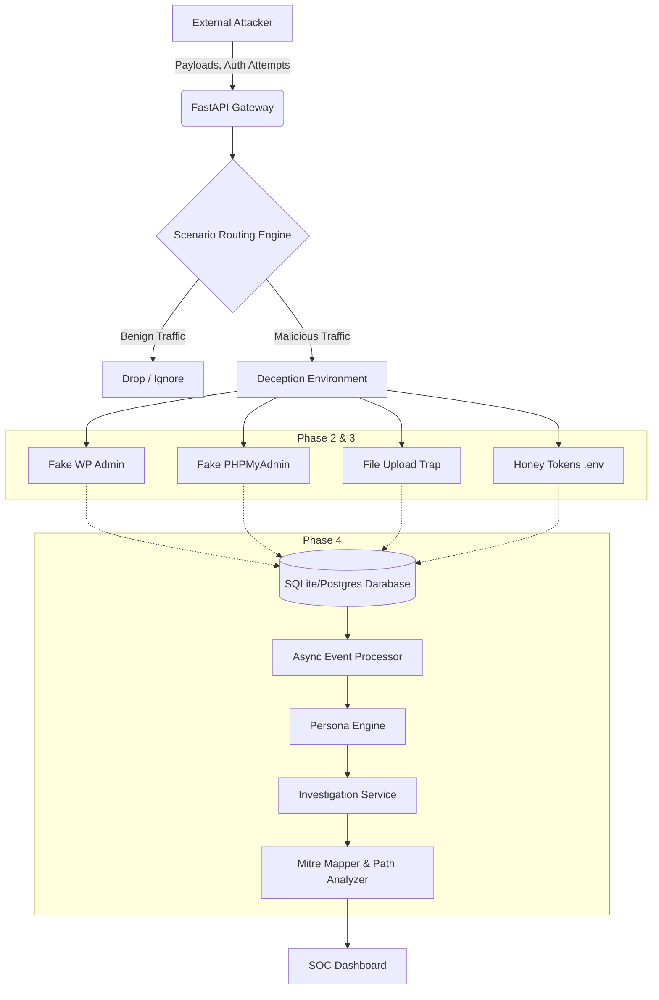
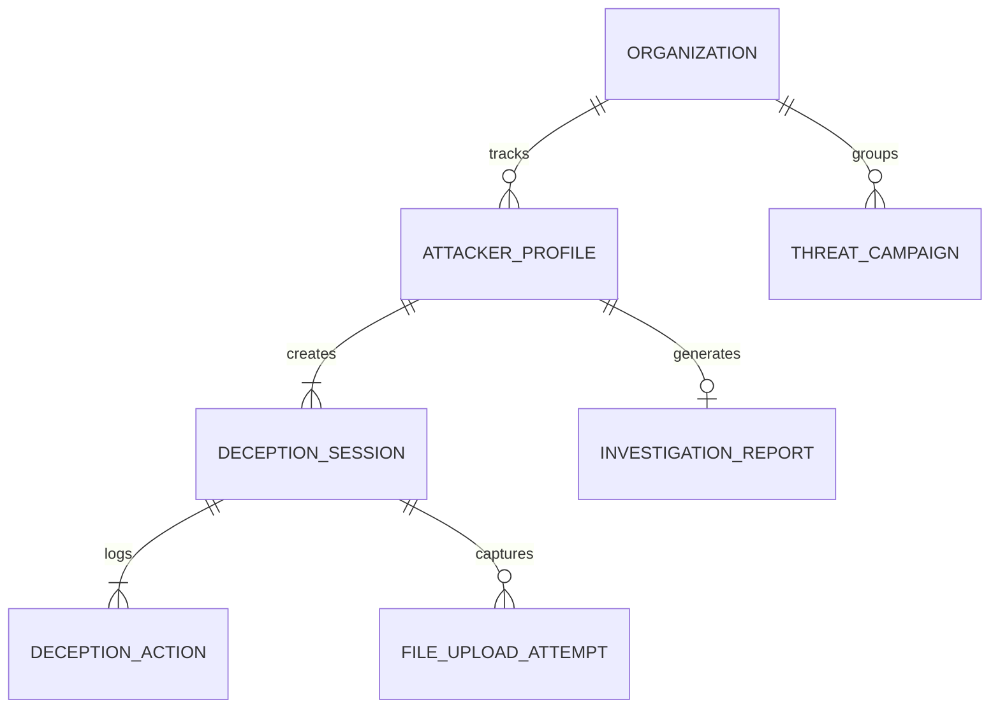

# HoneyCloud-X System Architecture

HoneyCloud-X is a production-grade, highly scalable honeypot and threat intelligence platform designed to trap, analyze, and profile sophisticated attackers in real-time.

## 1. High-Level Architecture

The system follows an event-driven, decoupled architecture to ensure that the deception environment can scale independently from the analysis engines.

## 2. Core Components

### 2.1 Threat Routing Engine (Phase 1)
All incoming payloads hit `/api/ingest`. The Routing Engine evaluates the payload signature and severity to assign a temporary risk profile. If the attacker is deemed dangerous, they are transparently routed into the isolated Deception Environment without breaking their session state.

### 2.2 Deception Environment (Phase 2 & 3)
A suite of highly interactive, fake endpoints.
- **Form Traps:** Fake login forms for WordPress (`/wp-login.php`) and Databases.
- **Upload Traps:** Secure file sinks that hash malware payloads and discard the binary to strictly enforce honeypot isolation.
- **Honey Tokens:** Fake `.env` files exposing decoy AWS and Database credentials to track deeper lateral movement attempts.

### 2.3 Threat Intelligence & Personas (Phase 3 & 4)
As attackers navigate the honeypot, the `PersonaEngine` continuously calculates their intent, categorizing them as:
1. `Scanner` (Default surface-level)
2. `Credential Hunter` (Brute force attempts)
3. `Persistence Seeker` (File upload attempts)
4. `Data Thief` (Honey token triggers)

### 2.4 Investigation Workbench (Phase 4)
An asynchronous pipeline that aggregates an attacker's entire session history to auto-generate:
- **Threat Narratives:** Human-readable explanations of the attack.
- **MITRE ATT&CK Mapping:** Associates actions with TTPs (e.g., T1083, T1505.003).
- **Correlation Grouping:** Groups similar profiles into unified Threat Campaigns based on IP subnets and identical payloads.

## 3. Database Schema Overview

## 4. Performance & Scalability
- **Asynchronous Processing:** Event ingestion returns immediately (<50ms). Deep investigation and Persona calculations run asynchronously via FastAPI `BackgroundTasks`.
- **Database Optimization:** Composite indexes on `session_id` and `timestamp` ensure fast path-reconstruction even with millions of rows.
- **Stateless Deception:** The honeypot endpoints are entirely stateless, pulling session state via standard `X-API-Key` and URL `sid` parameters, making the frontend infinitely horizontally scalable.
