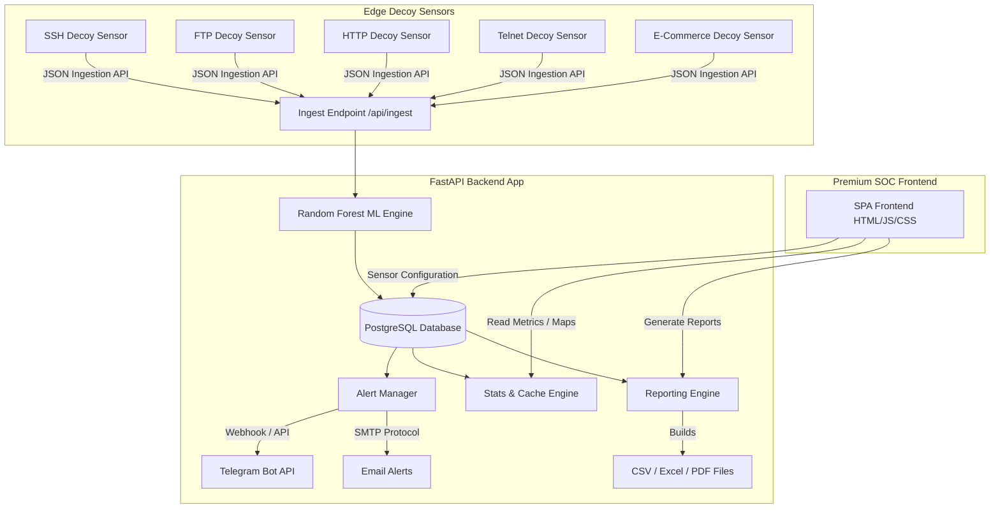
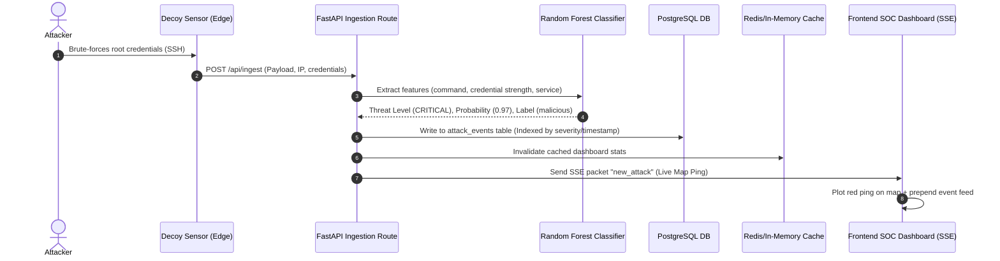

# HoneyCloud-X Portfolio & Recruiter Package

Welcome to the HoneyCloud-X Showcase Package. This document contains comprehensive architecture blueprints, deployment schematics, and demo resources designed to present this project to hiring managers, technical interviewers, and recruiters.

---

## 1. Project Summary & Elevator Pitch

### The Hook
> "HoneyCloud-X is an enterprise-grade, AI-Powered Cloud Honeypot and Threat Intelligence platform. It mimics critical vulnerabilities (SSH, FTP, HTTP, Telnet, E-Commerce platforms) to attract, capture, analyze, and automatically neutralize malicious activity. Using a custom-trained Random Forest model, HoneyCloud-X classifies threats in real-time, mapping attacks to the MITRE ATT&CK framework and feeding live telemetry into a high-performance Security Operations Center (SOC) dashboard."

### The "Why"
Traditional honeypots are isolated and difficult to parse. HoneyCloud-X acts as a multi-tenant SaaS platform that orchestrates edge decoy sensors, runs ML classification at ingestion, automatically routes indicators of compromise (IoCs) to blocklists (like AbuseIPDB) or notifying channels (Telegram, SMTP), and provides executive reporting—all packaged in a modern visual pane inspired by CrowdStrike and Microsoft Defender.

---

## 2. System Architecture Blueprint



---

## 3. Data Flow Diagram (Telemetric Pipeline)



---

## 4. Deployment Blueprint

```
+-------------------------------------------------------+
|                 FRONTEND (Vercel SPA)                 |
|                                                       |
|   - Serves static HTML/JS/CSS                         |
|   - Pulls dynamic configuration from backend /config.js|
|   - Leaflet.js maps & Chart.js panels                 |
+-------------------------------------------+-----------+
                                            |
                                  HTTPS (TLS 1.3)
                                            |
                                            v
+-------------------------------------------------------+
|                BACKEND (Render Web Service)            |
|                                                       |
|   - Uvicorn / FastAPI ASGI Server                      |
|   - Environment variables (SMTP, Telegram, JWT)       |
|   - Connection pool (SQLAlchemy QueuePool)            |
+-------------------------------------------+-----------+
                                            |
                                       TCP Connection
                                            |
                                            v
+-------------------------------------------------------+
|               DATABASE (Managed PostgreSQL)           |
|                                                       |
|   - Schema: users, organizations, attack_events, keys |
|   - Indexes on search keys (severity, timestamp)       |
+-------------------------------------------------------+
```

---

## 5. Recruiter Demo Guide & Script

This walk-through script highlights the core security capabilities of the platform during a live screen share or video demo.

### Preparation
1. Open the **HoneyCloud-X Landing Page**.
2. Click **View Demo** to trigger the one-click SOC Analyst log in.
3. Keep the **SOC Dashboard** open in one half of the screen.

### Walkthrough Script

| Step | Action | Talk Track | Key Feature |
|---|---|---|---|
| **1** | Point to the SOC Theme | *"Welcome to the HoneyCloud-X dashboard. The interface is optimized as a dark-mode SOC pane styled after platforms like CrowdStrike. As you can see, all data is loaded in real-time."* | Professional UI |
| **2** | Point to top metrics | *"Our top metrics display Total Attacks, Critical threats, Blocked IPs, Active honeypot sensor nodes, and the current Machine Learning confidence score."* | SOC metrics |
| **3** | Click **Simulate Attacks** | *"Let's simulate a cluster of live attacks. Watch the threat origin map. As the simulations populate, we see global threat markers pinging from coordinates across Brazil, China, Germany, and Russia."* | Live Attack Simulation |
| **4** | Click **Inspect** on an event | *"If I drill down on any of these events, we see deep forensics: the raw payload, the geolocation, the threat score, and automatic MITRE ATT&CK mapping (e.g. T1110 for Brute Force). I can also trigger an immediate mock SOAR Block IP action."* | Threat Investigation |
| **5** | Navigate to **Reports** | *"On the reporting page, the analyst can view the dynamic Risk Score and recommendations. I can compile an executive summary report instantly in CSV, Excel, or PDF format."* | Export & Compliance |
| **6** | Navigate to **Settings** | *"In settings, the analyst can manage Decoy Sensors, rotate API Keys, and set up notification integrations (Telegram/Email Webhooks) to alert the team of high-priority attacks."* | Configuration |

---

## 6. Interview Cheat Sheet

Be ready to answer these technical deep-dive questions during system design or security interviews:

### Q: Why build a custom machine learning model instead of basic rules?
> **Answer:** Simple signature rules fail against zero-day commands and variations in payload structures. Our Random Forest model analyzes payload length, entropy, command patterns, and service vectors to calculate a precise anomaly probability score, catching obfuscated payloads that signature systems miss.

### Q: How does your PostgreSQL database scale under heavy ingestion?
> **Answer:** We use connection pooling (SQLAlchemy `QueuePool`) to recycle connections. Furthermore, we designed compound indices on search columns: `(organization_id, timestamp)` and `(organization_id, severity)`. This ensures that loading dashboard feeds or filtering high-severity alerts performs in $O(\log N)$ time, even with millions of events.

### Q: How did you solve client-side configuration injection?
> **Answer:** In static frontends, hardcoding localhost is common but breaks in production. We implemented a dynamic endpoint in FastAPI: `/config.js`. This reads the production environment variables (`VITE_API_URL`, etc.) on the fly and serves them as a global config script. The client loads `<script src="/config.js"></script>`, resolving cross-environment configuration seamlessly.
